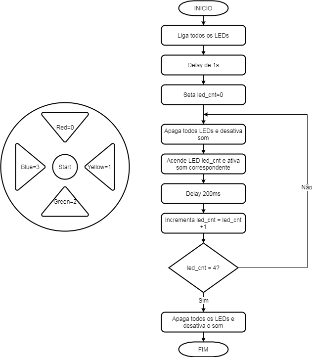

# Simon Game

## Especificações

### Características físicas

Dispositivo em formato circular contendo quatro botões coloridos, um botão de start, uma chave liga-desliga e uma chave seletora de nível. Cada botão deverá ter um LED colorido associado. O dispositivo deve também possuir um buzzer ou alto falante para emissão dos sinais sonoros. A alimentação deverá ser realizada usando quatro pilhas no formato AA.

### Funcionamento geral

Ao colocar a chave on-off no estado on,o dispositivo é energizado permitindo que todos os periférios do jogo funcionem e é executada a **rotina de inicialização**. 

Após a rotina de inicialização, será exibida uma sequencia de movimentos, a qual o usuário deverá repetir na sequência. A sequencia inicial irá exibir somente um movimento. Após a exibição da sequência de movimentos, o usuário deverá repeti-la apertando os botões na ordem que a sequencia foi apresentada. Se o usuário digitar a sequência corretamente, será exibida uma nova sequência. A nova sequência constitui da sequência anterior, com a adição de mais um movimento. Esse processo prossegue até o usuário alcançar uma sequência de 32 movimentos.

Cada movimento consiste na ativação de um dos LEDs coloridos, bom como na emissão de um sinal sonoro corresopndente a cor do LED ativado. A exibição do movimento tem duração de 0.5 segundos e o tempo entre a exibição dos movimento é dependendente do nível de dificuldade, podendo ser 5 segundos (nível fácil) ou 3 segundos (nível difícul).

Se o usuário errar algum movimento, ou levar tempo superior a 5 segundos para realizar um movimento, o último movimento será exibido novamente e então será executada a **rotina de erro**. Para iniciar o jogo novamente o usuário deverá apertar o botão start

Se o usuário conseguir realizar uma sequencia de 32 movimentos, será executada a **rotina de vitória**, indicando que o jogo terminou. Para iniciar o jogo novamente o usuário deverá apertar o botão start.

### Frequências sonoras 

Deverá ser emitido um som de acordo com a cor do LED aceso em cada movimento, como mostrado a seguir:

* Blue: 209Hz

* Yellow: 252Hz

* Red: 310hz

* Green: 415Hz

### Rotina de inicialização

A sequência de inicialização pode ser representada pelo fluxograma exibido abaixo.

### Rotina de erro

### Rotina de vitória
